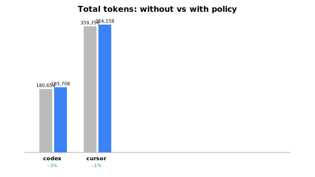

# Benchmark Results

_Generated by `analyze.py` from committed `runs/`. Read `benchmarks/README.md` for methodology and limitations._

- Agents / models: **codex** (`gpt-5.5`), **cursor** (`composer-2.5`)
- Reps per cell: up to 3
- Tasks: extract-json, grep-answer, summarize, trim-log

## Total tokens — WITH vs WITHOUT policy

| Agent | Task | Without | With | Reduction |
|-------|------|--------:|-----:|----------:|
| codex | extract-json | 45,423 | 46,699 | -2.8% |
| codex | grep-answer | 44,745 | 45,998 | -2.8% |
| codex | summarize | 45,723 | 46,979 | -2.7% |
| codex | trim-log | 44,763 | 46,032 | -2.8% |
| cursor | extract-json | 97,073 | 97,374 | -0.3% |
| cursor | grep-answer | 86,998 | 88,824 | -2.1% |
| cursor | summarize | 88,300 | 89,862 | -1.8% |
| cursor | trim-log | 86,984 | 88,098 | -1.3% |

## Per-agent overall reduction

| Agent | Without (sum of task means) | With | Reduction |
|-------|---------------------------:|-----:|----------:|
| codex | 180,654 | 185,708 | -2.8% |
| cursor | 359,356 | 364,158 | -1.3% |

