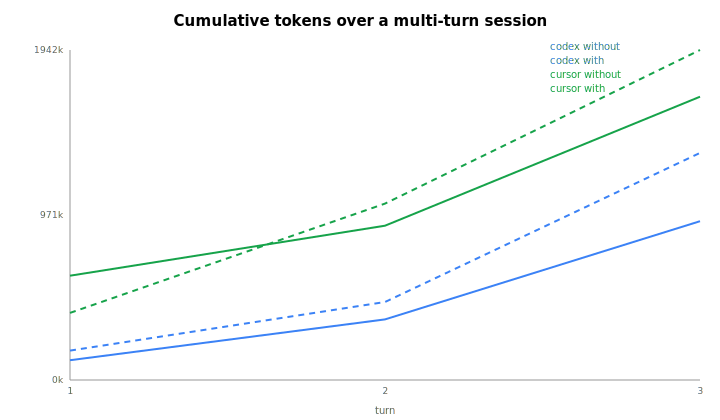

# Heavy Multi-Turn Benchmark Results

_Cumulative tokens over a persistent multi-turn session on a ~120k-token codebase. Generated by `analyze_heavy.py`. See `README.md` for method/limits._

- Agents / models: **codex** (`gpt-5.5`), **cursor** (`composer-2.5`)
- Turns per session: 3
- Reps per cell: 1

## Cumulative session tokens — WITH vs WITHOUT policy

| Agent | Without | With | Reduction |
|-------|--------:|-----:|----------:|
| codex | 934,421 | 1,335,875 | -43.0% |
| cursor | 1,666,611 | 1,941,525 | -16.5% |

_Lines: cumulative tokens vs turn. Solid = without policy, dashed = with. A flatter line = less transcript bloat resent each turn._

