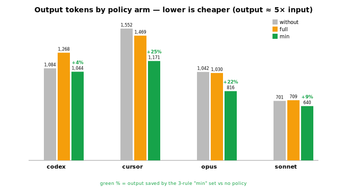
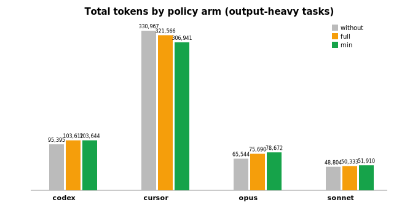

# Minimal-Policy Benchmark (output-heavy tasks)

_3 arms: no policy / full 12-rule policy / 3-rule minimal policy. Generated by `analyze_min.py`._

- Agents / models: **codex** (`gpt-5.5`), **cursor** (`composer-2.5`), **opus** (`claude-opus-4-8-high`), **sonnet** (`claude-4.6-sonnet-medium`)
- Tasks: describe-arch, explain-ledger, review-retry, summarize-doc
- Reps per cell: up to 3

## Mean tokens per arm

| Agent | Arm | Input | Output | Total | Δ total vs without |
|-------|-----|------:|-------:|------:|-------------------:|
| codex | without | 94,310 | 1,084 | 95,395 | — |
| codex | full | 102,344 | 1,268 | 103,612 | -8.6% |
| codex | min | 102,600 | 1,044 | 103,644 | -8.6% |
| cursor | without | 329,414 | 1,552 | 330,967 | — |
| cursor | full | 320,097 | 1,469 | 321,566 | +2.8% |
| cursor | min | 305,770 | 1,171 | 306,941 | +7.3% |
| opus | without | 64,502 | 1,042 | 65,544 | — |
| opus | full | 74,660 | 1,030 | 75,690 | -15.5% |
| opus | min | 77,856 | 816 | 78,672 | -20.0% |
| sonnet | without | 48,103 | 701 | 48,804 | — |
| sonnet | full | 49,624 | 709 | 50,333 | -3.1% |
| sonnet | min | 51,270 | 640 | 51,910 | -6.4% |

## Output tokens only (the channel the model controls)

| Agent | without | full | min | full Δout | min Δout |
|-------|--------:|-----:|----:|----------:|---------:|
| codex | 1,084 | 1,268 | 1,044 | -17.0% | +3.7% |
| cursor | 1,552 | 1,469 | 1,171 | +5.3% | +24.6% |
| opus | 1,042 | 1,030 | 816 | +1.2% | +21.7% |
| sonnet | 701 | 709 | 640 | -1.1% | +8.8% |

### Output tokens by arm — the economy (lower = better)

### Total tokens by arm (dominated by noisy, cached input)

